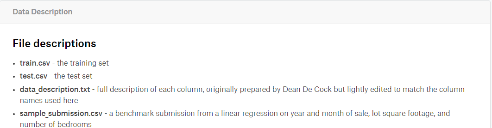
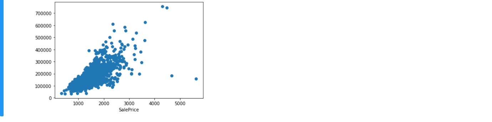
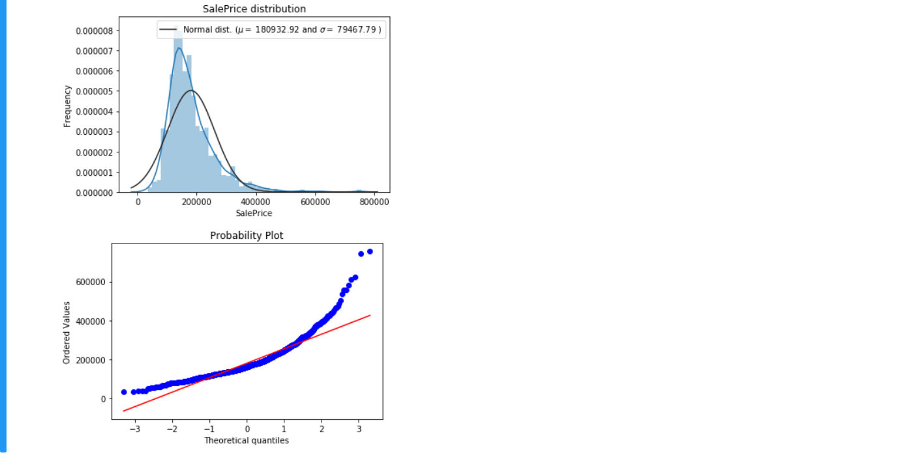
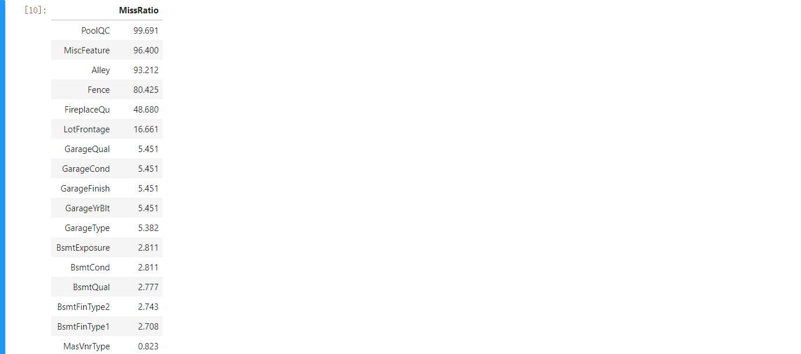
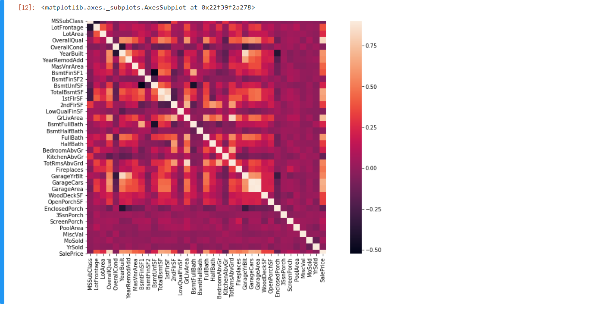
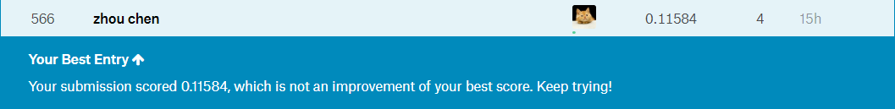

# 房价预测


## 简介
- Kaggle上的一个Getting Started级别的新手赛，主要为[房价预测的回归赛](https://www.kaggle.com/c/house-prices-advanced-regression-techniques)。具体比赛的级别之分，可以查看我关于Kaggle介绍的[博客](https://blog.csdn.net/zhouchen1998/article/details/101356627)。
- 详细的思路均在Notebook中标注，本文不多赘述过多理论思路，具体可以查看我之前关于数据挖掘赛的思路[博客](https://blog.csdn.net/zhouchen1998/article/details/101435593)。
- 共提交了两次，baseline和final两个版本，final版本参考了Kaggle上部分人的stacking思路。本文只简述Final版本的思路，baseline版本比较简单，可以在文末给出的Github地址找到源码。


## 数据获取
- 官方给出了数据，可以在Kernel（现Notebook）中直接访问该数据集，也可以下载到本地，官方给出了[下载地址](https://www.kaggle.com/c/house-prices-advanced-regression-techniques/data)。
- 数据的大致分为下面四个文件，官方给出了文件说明。
- 具体的表头属性的含义可以在data_description.txt查看，这对数据预处理和特征构造阶段尤其重要。


## 探索性数据分析
- 说明
  - 只是进行了一些必要的EDA操作。
- 离群点分析
  - ```python
    fig, ax = plt.subplots()
    ax.scatter(x=df_train['GrLivArea'], y=df_train['SalePrice'])
    plt.xlabel('GrLivArea')
    plt.xlabel('SalePrice')
    plt.show()
    # 该离群点可以删除是因为确实离群范围过大，严重影响模型拟合，不是所有的离群点都应该删除的 
    df_train = df_train.drop(df_train[(df_train['GrLivArea'] > 4000)&(df_train['SalePrice']<300000)].index)
    ```
  - 
- 目标分布分析
  - ```python
    sns.distplot(df_train['SalePrice'], fit=norm)  # 使用正态分布拟合数据
    (mu, sigma) = norm.fit(df_train['SalePrice'])  # 对样本进行拟合，得到最合适的采样数据的概率密度函数的系数
    plt.legend(['Normal dist. ($\mu=$ {:.2f} and $\sigma=$ {:.2f} )'.format(mu, sigma)], loc='best')
    plt.ylabel('Frequency')
    plt.title('SalePrice distribution')

    fig = plt.figure()
    res = probplot(df_train['SalePrice'], plot=plt)
    plt.show()
    ```
  - 
- 空值分析
  - ```python
    all_data_null = df_all.isnull().sum() / len(df_all) * 100  # 统计各列的空值数目
    all_data_null = all_data_null[all_data_null>0].sort_values(ascending=False)
    miss_data = pd.DataFrame({'MissRatio': all_data_null})
    miss_data.head(30)
    ```
  - 
- 相关性分析
  - ```python
    corr_mat = df_train.corr()
    plt.subplots(figsize=(16, 8))
    sns.heatmap(corr_mat, vmax=0.9, square=True)
    ```
  - 


## 特征工程
- 说明
  - 这一步是整个流程费时最久的，进行了大量的属性处理和理解。
- 空值处理
  - 一般不会对空值记录进行删除，这会造成信息的大量丢失，最合理的做法是依照说明文件，对各属性进行理解，选择最合适的填充方法进行空值填充。
  - ```python
    # 按照说明文件，PoolQC为空表示没有泳池，考虑到该列较高的缺失率以及大多数房子都是没有泳池的，直接None填充
    df_all['PoolQC'] = df_all['PoolQC'].fillna("None")
    # 下面几项均可以按照说明文件，直接填None
    cols = ['MiscFeature', 'Alley', 'Fence', 'FireplaceQu', 'GarageType', 'GarageFinish', 'GarageQual', 'GarageCond']
    for col in cols:
        df_all[col] = df_all[col].fillna("None")
    # 街道面积与同社区的其他房屋的街道面积类似，取所有邻居中位数即可
    df_all["LotFrontage"] = df_all.groupby("Neighborhood")["LotFrontage"].transform(lambda x: x.fillna(x.median()))
    # 根据属性含义，下面的属性直接填0
    cols = ['GarageYrBlt', 'GarageArea', 'GarageCars', 'BsmtFinSF1', 'BsmtFinSF2', 'BsmtUnfSF','TotalBsmtSF', 'BsmtFullBath', 'BsmtHalfBath']
    for col in cols:
        df_all[col] = df_all[col].fillna(0)
    # 下面的属性为空表示无值
    cols = ['BsmtQual', 'BsmtCond', 'BsmtExposure', 'BsmtFinType1', 'BsmtFinType2']
    for col in cols:
        df_all[col] = df_all[col].fillna('None')
    # 下面两个属性为NA最可能意味空值
    df_all["MasVnrType"] = df_all["MasVnrType"].fillna("None")
    df_all["MasVnrArea"] = df_all["MasVnrArea"].fillna(0)
    # 众数填，RL最合适
    df_all['MSZoning'] = df_all['MSZoning'].fillna(df_all['MSZoning'].mode()[0])
    # 该属性只有三个不同值，其余均为一个结果，该列对模型拟合没有太大意义，删除即可
    df_all = df_all.drop(columns=['Utilities'], axis=1)
    # 根据说明，Typ代表典型值
    df_all["Functional"] = df_all["Functional"].fillna("Typ")
    # 经过分析，下面的属性均众数填充即可
    cols = ['Electrical', 'KitchenQual', 'Exterior1st', 'Exterior2nd', 'SaleType']
    for col in cols:
        df_all[col] = df_all[col].fillna(df_all[col].mode()[0])
    # 填None
    df_all['MSSubClass'] = df_all['MSSubClass'].fillna("None")
    ```
- 属性变换
  - 这一步主要将字符型数据进行自然数编码，onehot编码之类的，最终产生全部为数值的数据。
  - ```python
    # 部分看起来数值型的变量，其实取值只有几种，转换为分类变量合适一些
    df_all['MSSubClass'] = df_all['MSSubClass'].apply(str)
    df_all['OverallCond'] = df_all['OverallCond'].astype(str)
    df_all['YrSold'] = df_all['YrSold'].astype(str)
    df_all['MoSold'] = df_all['MoSold'].astype(str)
    # 将部分分类变量转化为数值型
    from sklearn.preprocessing import LabelEncoder
    cols = ('FireplaceQu', 'BsmtQual', 'BsmtCond', 'GarageQual', 'GarageCond', 
            'ExterQual', 'ExterCond','HeatingQC', 'PoolQC', 'KitchenQual', 'BsmtFinType1', 
            'BsmtFinType2', 'Functional', 'Fence', 'BsmtExposure', 'GarageFinish', 'LandSlope',
            'LotShape', 'PavedDrive', 'Street', 'Alley', 'CentralAir', 'MSSubClass', 'OverallCond', 
            'YrSold', 'MoSold')
    for col in cols:
        lbl = LabelEncoder() 
        lbl.fit(list(df_all[col].values)) 
        df_all[col] = lbl.transform(list(df_all[col].values))

    # labelencoder不会像get_dummies那样生成多个属性
    df_all.shape
    ```
- 属性构造
  - 有理由的对已有特征进行组合，构造对模型有效的新特征。本赛题只构建了房屋全面积这个属性。随后，对所有特征进行高偏特征的Box-Cox变换，具体查看源码。
  - ```python
    # 根据经验，面积对于房价的影响时非常大的，构造房屋总面积这个属性
    df_all['TotalArea'] = df_all['TotalBsmtSF'] +  df_all['1stFlrSF'] + df_all['2ndFlrSF']
    ```


## 模型构建
- 说明
  - 本部分还是采用挖掘赛常用的思路，对若模型结果进行集成，主要使用的是Stacking方法。
- 平均模型
  - ```python
    # 采用stacking方法
    class StackingAveragedModels(BaseEstimator, RegressorMixin, TransformerMixin):
        def __init__(self, base_models, meta_model, n_folds=5):
            self.base_models = base_models
            self.meta_model = meta_model
            self.n_folds = n_folds
    
        def fit(self, X, y):
            self.base_models_ = [list() for x in self.base_models]
            self.meta_model_ = clone(self.meta_model)
            kfold = KFold(n_splits=self.n_folds, shuffle=True, random_state=156)
            
            out_of_fold_predictions = np.zeros((X.shape[0], len(self.base_models)))
            for i, model in enumerate(self.base_models):
                for train_index, holdout_index in kfold.split(X, y):
                    instance = clone(model)
                    self.base_models_[i].append(instance)
                    instance.fit(X[train_index], y[train_index])
                    y_pred = instance.predict(X[holdout_index])
                    out_of_fold_predictions[holdout_index, i] = y_pred
                    
            self.meta_model_.fit(out_of_fold_predictions, y)
            return self
    
        def predict(self, X):
            meta_features = np.column_stack([
                np.column_stack([model.predict(X) for model in base_models]).mean(axis=1)
                for base_models in self.base_models_ ])
            return self.meta_model_.predict(meta_features)

    stacked_averaged_models = StackingAveragedModels(base_models = (ENet, GBoost, KRR, ABR), meta_model = lasso)
    score = rmse_cv(stacked_averaged_models)
    print("Stacking Averaged models score: {:.4f} ({:.4f})".format(score.mean(), score.std()))
    ```
    - 集成的模型具有不错的效果。
- 多模型加权组合
  - 将多个集成模型，分别为采用Stacking的自定义模型，采用Boosting的Xgboost和Lightgbm进行结果加权组合。
  - ```python
    print("Final RMSE Loss in training dataset", rmse(y_train, stacked_train_pred*0.70+xgb_train_pred*0.15+lgb_train_pred*0.15))
    ```
  - 加权组合的结果如下，看起来不错，这就是最后提交的模型。


## 模型应用
- 说明
  - 使用模型进行预测，测试集的处理同训练集。final版本的提交达到了top10%，由于这里只是使用最简单的几种模型stacking，尝试更多的模型和参数调整会获得更好的结果。（调参只是“锦上添花”）
- 提交结果
  - baseline
  - final


## 补充说明
- 项目的源码和数据集都上传到我的Github，欢迎查看。
- 文章同步到我的个人博客网站，欢迎查看其他文章。
- 如有错误，欢迎指正。