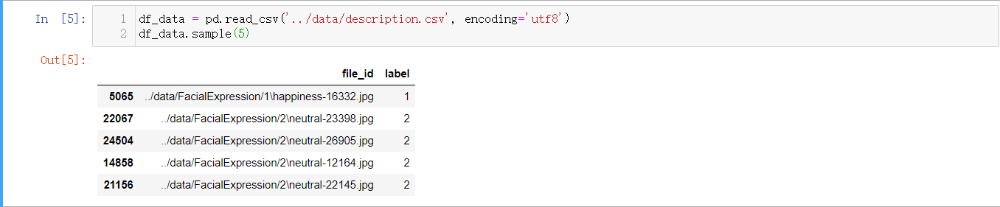
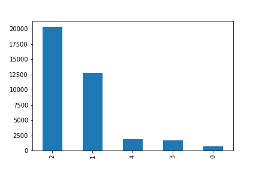
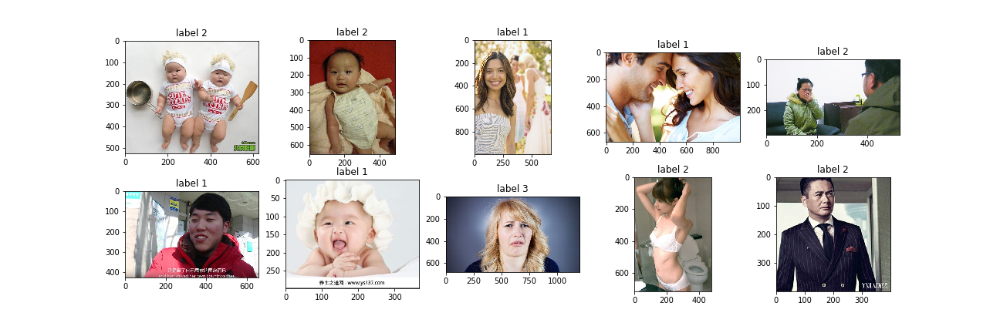
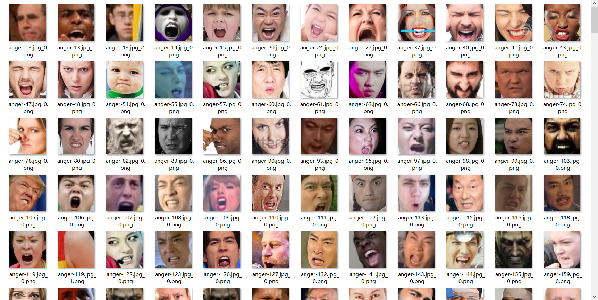
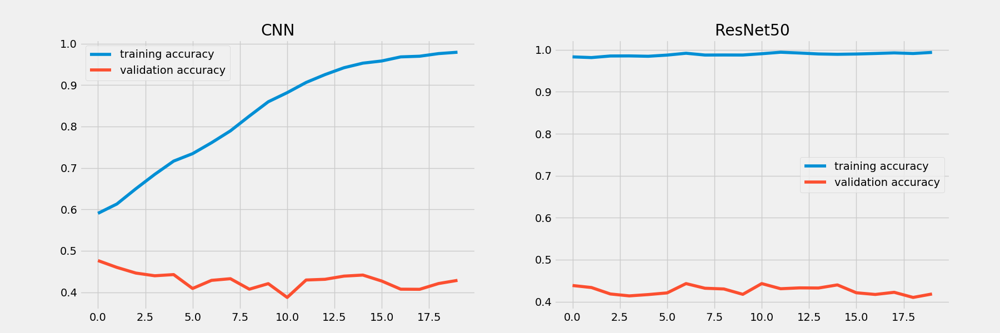

# 人脸表情识别


## 简介
这是科赛网曾今的一次计算机视觉类的分类赛，属于一个视觉基础任务。关于人脸表情识别，Kaggle等平台也举办过相关的比赛，难度并不算大，但是对技巧的要求比较高。本文详述该比赛的主要步骤，并构建多个模型对比效果。


## 数据探索

这部分主要是对数据集的简单探索，由于计算机视觉类比赛数据多为图片或者视频格式，无需像挖掘赛那样进行比较复杂的EDA。这部分的代码可以在文末给出的Github仓库的`EDA.ipynb`文件中找到。

数据集的目录形式如下（数据集分享于[百度云](https://pan.baidu.com/s/1DHGOccdrbmjDst14VjWITw)，提取码为zczc），由于本比赛只需要将五种区分度比较明显的表情识别出来，所以共五个文件夹，每个文件夹内的图片为一类。


首先，生成了如下的csv格式的数据集说明文件如下，包含两列，分别为文件的相对路径和标签。对该说明文件进行分析更加的方便，因为这个文件包含大多数数据集的信息，且Pandas提供了很多分析的API，很容易对表格数据处理。



首先观察类别的分布，很遗憾，数据的类别分布如下。这是因为有的表情数据确实很少，尽管我们确实希望数据的分布是均衡的，但是这里的影响也不是很大，后面通过数据增强，会对这个情况有所改善。



随后，随机采样10张图片展示并显示标签，结果如下。通过这一步的观察，不难发现，其实图片中不仅仅是目标-人脸表情，有很多背景干扰因素，这就要求需要进行人脸检测及图片裁减了，也就是输入深度模型中的不应该是原图而应该是裁减后的人脸图片。




## 数据预处理
这部分主要对图片进行人脸截取，实现的原理是基于目标检测的思路，分为传统方法和深度方法，为了更快得到结果，这里使用软件包`face_recognition`进行人脸检测（**注意处理单图片多人脸情况**），这是一个非常简单的封装好的人脸识别库，可以通过pip安装（若安装出错一般是dlib问题，安装dlib的我回来文件即可）。

其人脸检测的结果保存到本地后结果如下。**注意，这个数据生成的过程时间较长。**



核心代码如下，具体代码见文末Github。
```python
def preprocess():
    categories = os.listdir(data_folder)
    for category in categories:
        in_path = os.path.join(data_folder, category)
        out_path = os.path.join(generate_folder, category + '_face')
        if not os.path.exists(out_path):
            os.mkdir(out_path)
        for file in glob(in_path + '/*.jpg'):
            file_name = file.split('\\')[-1]
            print(file_name)
            img = face_recognition.load_image_file(file)
            if max(img.shape) > 2000:
                if img.shape[0] > img.shape[1]:
                    img = cv2.resize(img, (2000, int(2000 * img.shape[1] / img.shape[0])))
                else:
                    img = cv2.resize(img, (int(2000 * img.shape[0] / img.shape[1]), 2000))
            locations = face_recognition.face_locations(img)  # 人脸检测，大部分为单个，但也有多个检测结果
            if len(locations) <= 0:
                print("no face")
            else:
                for i, (a, b, c, d) in enumerate(locations):
                    image_split = img[a:c, d:b, :]
                    image_split = scale_img(image_split)
                    Image.fromarray(image_split).save(os.path.join(out_path, file_name + '_{}.png'.format(i)))
```


## 数据加载
由于数据集已经被处理为很规范的数据集格式，这里直接调用TF2中Keras接口解析数据集（自己写迭代器也是合适的，这里为了开发的速度采用封装好的API），返回一个迭代器，同时在该接口中设置一些数据增强手段，这里主要使用水平翻转。
具体代码如下，关于如何使用Keras的数据加载接口可以见[我之前的博客](https://zhouchen.blog.csdn.net/article/details/97495460)。

代码如下，具体整个项目的代码见文末Github。
```python
class DataSet(object):

    def __init__(self, root_folder):
        self.folder = root_folder
        self.df_desc = pd.read_csv(self.folder + 'description.csv', encoding="utf8")

    def get_generator(self, batch_size=32, da=True):
        if da:
            # 数据增强
            train_gen = ImageDataGenerator(rescale=1 / 255., validation_split=0.2, horizontal_flip=True, shear_range=0.2,
                                           width_shift_range=0.1)
        else:
            train_gen = ImageDataGenerator(rescale=1 / 255., validation_split=0.2, horizontal_flip=False)
        img_size = (64, 64)
        train_generator = train_gen.flow_from_dataframe(dataframe=self.df_desc,
                                                        directory='.',
                                                        x_col='file_id',
                                                        y_col='label',
                                                        batch_size=batch_size,
                                                        class_mode='categorical',
                                                        target_size=img_size,
                                                        subset='training')
        valid_generator = train_gen.flow_from_dataframe(dataframe=self.df_desc,
                                                        directory=".",
                                                        x_col="file_id",
                                                        y_col="label",
                                                        batch_size=batch_size,
                                                        class_mode="categorical",
                                                        target_size=img_size,
                                                        subset='validation')
        return train_generator, valid_generator
```


## 模型构建
主要尝试了构建一个简单的CNN模型进行训练和预测，这是模型较浅，这是考虑到可能的部署后的速度而采取的设计方法；此外，使用ResNet50模型结构尝试训练和预测。本文采用TensorFlow2.0构建模型进行训练，这是TF2是一个很不错的深度学习框架，相比于TF1很容易学习和使用，具体的可以查看我[TensorFlow2系列的教程博客](https://blog.csdn.net/zhouchen1998/category_9370890.html)。

```python
def CNN(input_shape=(224, 224, 3), n_classes=5):
    # input
    input_layer = Input(shape=input_shape)
    x = Conv2D(32, (1, 1), strides=1, padding='same', activation='relu')(input_layer)
    # block1
    x = Conv2D(64, (3, 3), strides=1, padding='same')(x)
    x = PReLU()(x)
    x = Conv2D(64, (5, 5), strides=1, padding='same')(x)
    x = PReLU()(x)
    x = MaxPooling2D(pool_size=(2, 2), strides=2)(x)
    # fc
    x = Flatten()(x)
    x = Dense(2048, activation='relu')(x)
    x = Dropout(0.5)(x)
    x = Dense(1024, activation='relu')(x)
    x = Dropout(0.5)(x)
    x = Dense(n_classes, activation='softmax')(x)

    model = Model(inputs=input_layer, outputs=x)
    return model


def ResNet_pretrained(input_shape=(224, 224, 3), n_classes=5):
    input_layer = Input(shape=input_shape)
    densenet121 = ResNet50(include_top=False, weights=None, input_tensor=input_layer)
    x = GlobalAveragePooling2D()(densenet121.output)
    x = Dropout(0.5)(x)
    x = Dense(n_classes, activation='softmax')(x)

    model = Model(input_layer, x)
    return model
```

对比两个模型的效果如下图，训练集很快达到接近100%的准确率，验证集却几乎不怎么变化，说明模型的效果还是比较一般的，这主要是因为不同类的数据量差距太大（有的类别几百个样本有的类别几万个样本），模型很难训练，或者说很快达到极限。



这里注意，表情识别比赛只是一个简单的分类赛，采用合适的深度特征提取网络即可取得不错的效果，对于这种分类问题一般采用端到端的模型设计即可，即使用分类损失交叉熵进行预测结果衡量，优化器选择的是Adam，当然，为了更加适应任务可以自己设计合适的损失函数如focal损失，当然，这也只是锦上添花而已，真正需要优化的还是模型的结构。此外，也可以考虑RGB转为Gray图从而减少冗余信息等手段，或者引入更多的数据集进行训练。


## 补充说明
真正构建实际系统是可以在模型应用的预测端进行一个增广预测，将得到的结果进行加权从而得到真正的预测结果，具体可以参考我之前的[项目](https://github.com/luanshiyinyang/ExpressionRecognition)。所有代码开源于[我的Github](https://github.com/luanshiyinyang/Competitions/tree/FacialExpression)，欢迎Star或者Fork。

