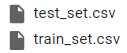
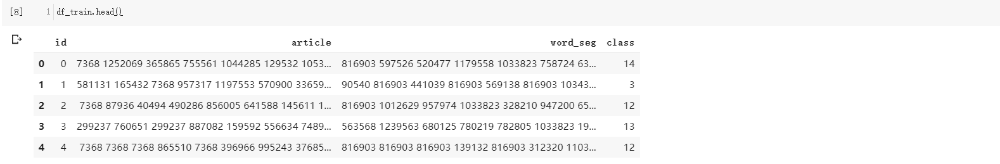
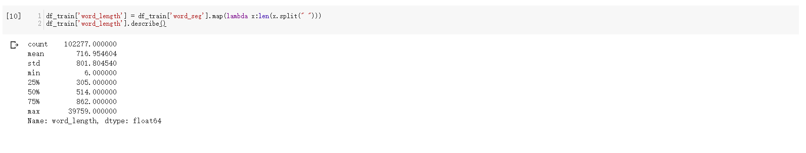
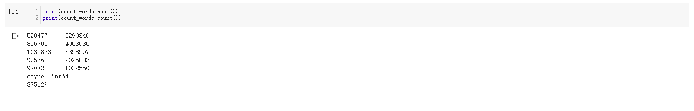
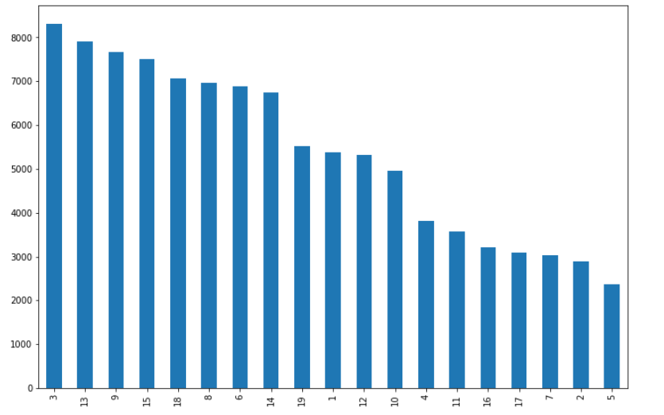

# 文本分类


## 简介
这是达观在2018年举办的一个文本分类比赛，是一场经典的NLP比赛，关于NLP赛的思路在[之前的博客](https://zhouchen.blog.csdn.net/article/details/103863618)中提到过，目前这场比赛已经结束，但是仍旧可以在DC上[提交成绩](https://www.dcjingsai.com/common/cmpt/%E2%80%9C%E8%BE%BE%E8%A7%82%E6%9D%AF%E2%80%9D%E6%96%87%E6%9C%AC%E6%99%BA%E8%83%BD%E5%A4%84%E7%90%86%E6%8C%91%E6%88%98%E8%B5%9B_%E7%AB%9E%E8%B5%9B%E4%BF%A1%E6%81%AF.html)，作为一个demo的比赛了。本文将简要对该比赛的思路进行介绍，采用传统方法和深度方法提交baseline模型。


## 数据探索
数据集可以直接到[官网](https://www.dcjingsai.com/common/cmpt/%E2%80%9C%E8%BE%BE%E8%A7%82%E6%9D%AF%E2%80%9D%E6%96%87%E6%9C%AC%E6%99%BA%E8%83%BD%E5%A4%84%E7%90%86%E6%8C%91%E6%88%98%E8%B5%9B_%E7%AB%9E%E8%B5%9B%E4%BF%A1%E6%81%AF.html)下载，下载后解压文件可以得到训练集和测试集，均为CSV格式的表格文件，可以采用Pandas进行读取和分析。



对训练集的数据进行初步探索，结果如下。其中id为文本标识码，article为文本字表示（每个数字对应一个汉字，不知道字表无法还原，这是为了保护文本中的隐私信息，称为脱敏操作，该操作不允许建模预测等），word_seg是文本的词表示，每个数字编号了一个单词，class为该文本的类别标签号。



为了后面模型的设计，有必要知道文本的长度范围是什么（下图探索词长度，即一个文本多少个词）。文本平均含有716个单词，是一个典型的长文本分类。



对词信息进行计数统计，结果如下。高频词出现了500万次，总共有875129个词。当然，低频词也有很多，这里不多说明，具体见文末Github地址。



对字的处理类似上面对于词的处理，不多说明，不过在NLP中词的信息远远多于字的信息量。

最后，可以看看**标签的分布**，可以使用Pandas接口轻易完成。




经过数据探索，不难发现这是一个长文本分类问题，且样本类别分布不均衡，同时词量特别大，会导致特征数量很多。


## Pipeline制定（传统方法baseline）
在这一部分会进行数据集的特征工程，构建模型，预测提交结果。

### 特征工程
首先采用传统方法提取文本特征，分别采用TFIDF和N-Gram，这两种方法都是在NLP中比较传统的基于统计的文本特征提取思路，其原理这里不多赘述，这里使用sklearn中封装好的API，其具体使用可以参考scikit-learn的官方文档。

使用下面的代码生成每个文本的特征向量，生成的特征向量是稀疏矩阵，scikit-learn中模型支持稀疏矩阵的输入。 

```python
from sklearn.feature_extraction.text import TfidfVectorizer

word_vec = TfidfVectorizer(analyzer='word',
            ngram_range=(1,2),
            min_df=3,  # 低频词
            max_df=0.9,  # 高频词
            use_idf=True,
            smooth_idf=True, 
            sublinear_tf=True)

train_doc = word_vec.fit_transform(df_train['word_seg'])
test_doc = word_vec.transform(df_test['word_seg'])
```

### 模型构建
这一部分先是采用最基本的机器学习分类模型---逻辑回归进行模型的训练及测试集的预测。
```python
from sklearn.linear_model import LogisticRegression
clf = LogisticRegression(C=4) 
clf.fit(train_doc, df_train['label'])
test_prob = clf.predict_proba(test_doc)
test_pred = np.argmax(test_prob, axis=1)
df_test['class'] = lb.inverse_transform(test_pred)
df_test[["id","class"]].to_csv("submission.csv", index=False, header=True, encoding='utf-8')
```

这个baseline的提交成绩

### 优化思路
后续的优化都是基于上面的baseline进行的。

**首先**，上述的特征工程均只使用了词的信息，没有使用字的信息，可以使用字的特征组合词的特征从而达到充分利用数据的目的。

**接着**，逻辑回归毕竟只是一个基本的分类模型，其实可以使用更强的集成模型如LightGBM、XGBoost等。


## Pipeline制定（深度方法）
在这一部分不会过度强调特征工程、模型等步骤，因为在